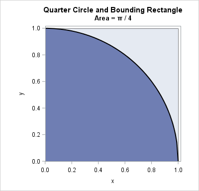

```{r setup, include=FALSE}
knitr::opts_chunk$set(
  echo = TRUE,
  out.width = "50%"
  )
```

## Estimating $\pi$ by a Monte Carlo simulation

Consider a quarter cirle with a radius of 1, its area will be $\pi$/4. Such a quarter circle fits nicely in a square of length 1 and area 1. Note that the ratio of the areas of the quarter circle to the square is also $\pi$/4.

```{r image1, echo=FALSE, out.width="40%"}


```

If we plot random points inside such a square and count the points that lie inside and outside the quarter circle, then the ratio of these 2 counts would give the ratio of $\pi$/4.

The task is now reduced to identifying & counting the points that are inside or outside the circle.


### The idea
Let's start with simulating some random points inside a 1 x 1 square. 
I picked 500 points.
```{r make-xy}
# create the points with their x,y coordinates
en <- 500
set.seed(199)
X <- runif(en, 0, 1)
Y <- runif(en, 0, 1)
```

To know if the point is inside or outside the quarter circle, we need to find the length.
And we do this with the Pythagorean theorem.
```{r find length}
# length of the x,y point
R = sqrt(X^2 + Y^2)
```
So now we have 3 vectors X, Y and R. Let's put them into a data frame.
Also remember to remove any duplicate points in the simulation.
```{r makedf}
# make a dataframe to hold the pairs of X, Y and the magnitude length R
df <- data.frame(cbind(X, Y, R))
  
# remove any duplicates
df <- unique(df)
```
Take a look at the first few rows
```{r show-df}
head(df)
```
To find and count the points that fall inside the quarter circle, we count the points where their lengths R are less than or equal to 1. 
```{r find-pts}
# P represents the number of points within area of the quarter circle
P = sum(df$R<=1)
```

The area of the square is given by the total number of points simulated, which in this case is the total rows in the data frame. And the estimate of $\pi$ is 4 times the ratio of P to the total rows.
```{r fin-pi}
Pi_est <- 4*P/nrow(df)
print(Pi_est, digits = 10)
```
Not bad... Our estimate of Pi is in the rough ball park.

The accuracy depends on how many points we have simulated for the areas of the quarter circle and the square. Obviously with the measly 500 points, the error is going to large. We can see this in a plot of the 500 points simulated. It doesn't really resemble much of a circle. So we need more points!

```{r show-plot1, echo=FALSE}
df$gp <- "Red"
df$gp[df$R<=1] <- "Blue"

# Plot the points on a square plot
par(pty="s")
plot(df$X, df$Y, col=df$gp)
```

### Add more points
Let's bump the number of points up to 10000 by setting `en <- 10000` and repeat the estimate.
```{r more-points, echo=FALSE}
  en <- 10000 #number of iterations per run
  set.seed(199)
  X <- runif(en, 0, 1)
  Y <- runif(en, 0, 1)
  R = sqrt(X^2 + Y^2)
  
  # make a dataframe to hold the pairs of X, Y and the magnitude length R
  df <- data.frame(cbind(X, Y, R))
  
  # remove any duplicates
  df <- unique(df)
  
  # P represents the points within area of the quarter circle
  P = sum(df$R<=1)
  
  # P/en gives the area of the quarter circle
  # 4*P/en gives an estimate of Pi
  # Pi_est is a vector containing all the estimates of pi
  Pi_est <- 4*P/en
  
  print(Pi_est)
```

Looking better. The points are shaping up nicely too!
```{r show-plot2, echo=FALSE}
df$gp <- "Red"
df$gp[df$R<=1] <- "Blue"

# Plot the points on a square plot
par(pty="s")
plot(df$X, df$Y, col=df$gp)
```

Obviously, running all that code only gets us 1 estimate of $\pi$. What we would like is a distribution of values for the estimate of $\pi$. To do this, we need to loop the code.


### Putting it altogether
Here, we put the code in a for-next loop. Let's run the loop 100 times and append each estimate to the vector `Pi_est`. We can get statistics out later with a `summary` command.
```{r thecodeloop, echo=TRUE}
# set the number of runs
Nrun <- 100

#set up an empty numeric vector to hold values for Pi estimate
Pi_est <- c(0)
Pi_est <- Pi_est[0] 


for (i in 1:Nrun) {
  options(digits=10) #increase decimal places
  en <- 10000 #number of iterations per run
  X <- runif(en, 0, 1)
  Y <- runif(en, 0, 1)
  R = sqrt(X^2 + Y^2)
  
  # make a dataframe to hold the pairs of X, Y and the magnitude length R
  df <- data.frame(cbind(X, Y, R))
  
  # remove any duplicates
  df <- unique(df)
  
  # P represents the points within area of the quarter circle
  P = sum(df$R<=1)
  
  # P/en gives the area of the quarter circle
  # 4*P/en gives an estimate of Pi
  # Pi_est is a vector containing all the estimates of pi
  Pi_est <- c(Pi_est, 4*P/nrow(df))
  
}
```

Let's take a look at the summary stats of our estimate of $\pi$. 

```{r summ-show}
summary(Pi_est)

```

And also plot the distribution of the 100 estimates in a histogram.

```{r show-hist}
hist(Pi_est)
```
  
  Since we didn't fix the seed of the random generator, the estimates are going change with every run of the code.  
  
  The precision of the estimate can be improved with running more loops or using more points of x-y pairs. Of course computation time will increase accordingly.  
    
  There you have it! An simple estimate of $\pi$ with a monte carlo simulation.

